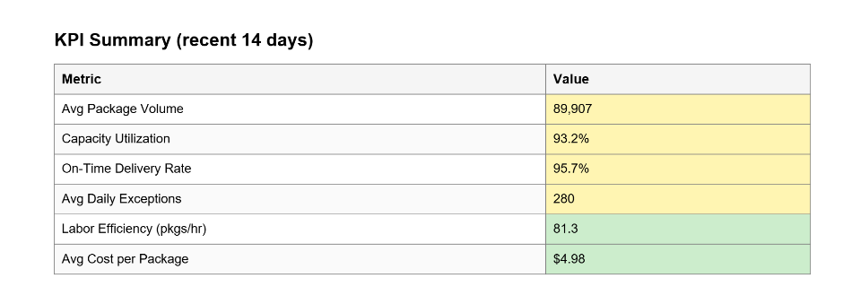

# FedEx Project Ops Decision Support (v1)

A Python-based operations decision-support and reporting tool modeled after an internal enterprise analytics system. The tool transforms synthesized shipment data into KPI tables, trend visualizations, and an executive-ready PDF report to support operational decision-making.

> **DISCLAIMER:** “FedEx” is used strictly as a placeholder name. All data in this repository is 100% synthetic.

---

## What this tool does
- Ingests shipment-level operational data (CSV)
- Computes core operational KPIs (service level, delays, exceptions, throughput)
- Generates clean charts for trend and performance analysis
- Produces a multi-page, stakeholder-ready PDF report
- Packages insights, assumptions, and roadmap into a single deliverable

---

## Why this exists
Internal operations teams often rely on standardized reporting artifacts rather than live dashboards alone.  
This project demonstrates how raw operational data can be converted into a repeatable, leadership-ready decision-support report.

---

## Output
- **PDF report:** [FedEx_Project_Ops_Report.pdf](reports/Fedex_Product_Ops_Report.pdf)
- **Screenshots:**
### Executive Summary


### KPI Table


### Trend Chart


---

## Tech stack
- Python
- pandas
- matplotlib
- ReportLab
- Dependencies: [requirements.txt](requirements.txt)

---

## Project Structure

```
fedex-project-ops-decision-support/
├── README.md
├── LICENSE
├── requirements.txt
├── reports/
│   └── FedEx_Project_Ops_Report.pdf
├── src/
│   ├── export_pdf.py   # report orchestration
│   ├── metrics.py      # KPI computation
│   ├── rules.py        # deterministic decision logic
│   └── insights.py     # optional narrative inputs
├── data/
│   └── sample/
│       └── shipments_sample.csv
└── docs/
    └── screenshots/
```


---

## How to run
By default, the tool runs on a **synthetic sample dataset** included at  
[`data/sample/shipments_sample.csv`](data/sample/shipments_sample.csv). 

You may substitute your own CSV if it follows the same schema.

### Input CSV Requirements

To generate a report using your own data, provide a CSV file with the following columns:

| Column Name          | Description |
|----------------------|-------------|
| `date`               | Date of operations (YYYY-MM-DD) |
| `scenario`           | Operating scenario (e.g. NORMAL, PEAK, DISRUPTION, LABOR_SHORTAGE) |
| `package_volume`     | Total packages processed that day |
| `network_capacity`   | Maximum network capacity for the day |
| `on_time_rate`       | On-time delivery rate (0–1) |
| `exceptions`         | Number of delivery exceptions |
| `labor_hours`        | Total labor hours worked |
| `cost_per_package`   | Average cost per package |

Additional columns may be present but are ignored. You may use the provided [sample dataset](data/sample/shipments_sample.csv) as a template.

### Environment setup
```bash
python -m venv .venv
source .venv/bin/activate  # Windows: .venv\Scripts\activate
pip install -r requirements.txt
2. Generate the report
bash
Copy code
python src/export_pdf.py
The script outputs a PDF report to the reports/ directory.

Data

Sample data mirrors realistic operational patterns and distributions

Assumptions & limitations
Metrics are illustrative and simplified for demonstration purposes

Root-cause attribution is not automated in v1

Designed as a reporting artifact, not a live dashboard

Roadmap
Parameterized report configuration (date ranges, thresholds)

Automated anomaly flagging

Lane- and region-level drilldowns

Unit tests and CI workflow

